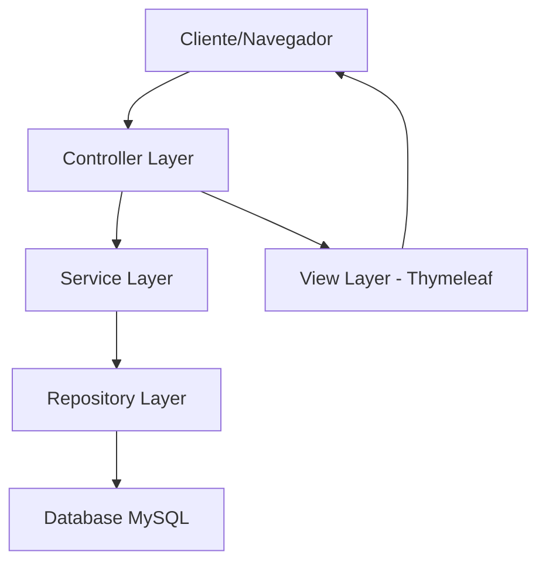
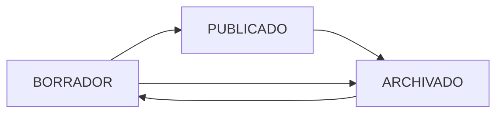
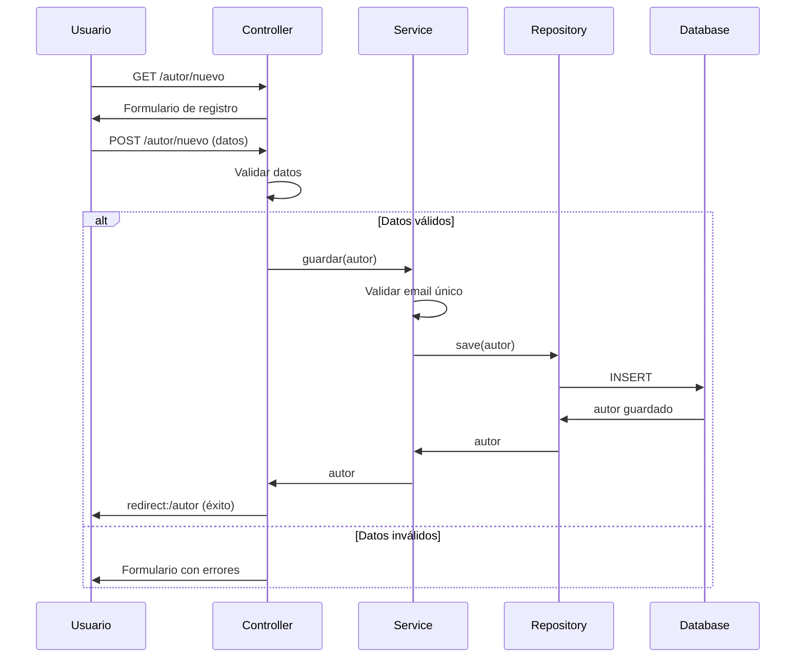
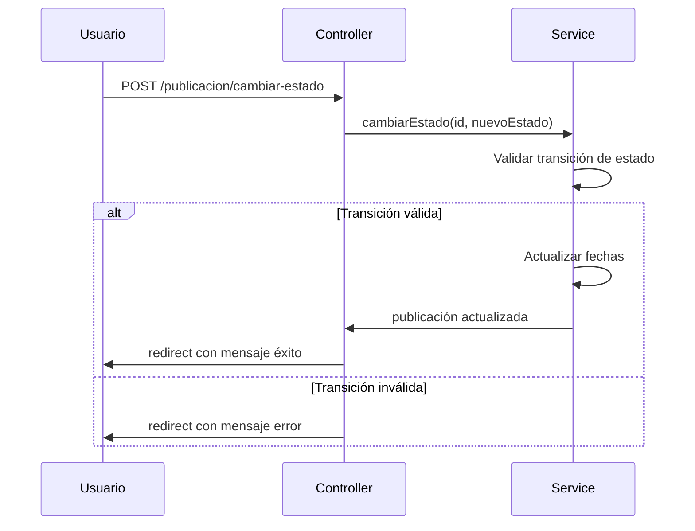

# Documentación Técnica - Blog Interno EVA-03

## 🏗 Arquitectura del Sistema

### Patrón de Arquitectura: MVC (Model-View-Controller)



### Capas de la Aplicación

#### 1. **Capa de Presentación (View)**

- **Tecnología:** Thymeleaf + Bootstrap 5.3
- **Ubicación:** `src/main/resources/templates/`
- **Responsabilidad:** Renderizado de vistas y interacción con el usuario

```
templates/
├── autor/
│   ├── autores-list.html      # Lista de autores
│   ├── autores-register.html  # Registro de autor
│   ├── autores-edit.html      # Edición de autor
│   └── autores-detail.html    # Detalle de autor
├── publicacion/
│   ├── publicaciones-list.html     # Lista de publicaciones
│   ├── publicaciones-register.html # Nueva publicación
│   ├── publicaciones-edit.html     # Editar publicación
│   └── publicaciones-detail.html   # Detalle de publicación
├── error/
│   ├── 404.html              # Página no encontrada
│   ├── 500.html              # Error servidor
│   └── error.html            # Error genérico
└── fragments/
    └── layout.html           # Layout base
```

#### 2. **Capa de Control (Controller)**

- **Tecnología:** Spring MVC
- **Ubicación:** `src/main/java/com/idat/eva03/controller/`
- **Responsabilidad:** Manejo de requests HTTP y coordinación

```java
// Ejemplo de controlador
@Controller
@RequestMapping("/autor")
public class AutorController {
  
    @GetMapping
    public String listarAutores(Model model) {
        model.addAttribute("autores", autorService.listarTodos());
        return "autor/autores-list";
    }
  
    @PostMapping("/nuevo")
    public String crearAutor(@Valid @ModelAttribute Autores autor, 
                           BindingResult result, Model model) {
        if (result.hasErrors()) {
            return "autor/autores-register";
        }
        autorService.guardar(autor);
        return "redirect:/autor";
    }
}
```

#### 3. **Capa de Servicio (Service)**

- **Tecnología:** Spring Service
- **Ubicación:** `src/main/java/com/idat/eva03/service/`
- **Responsabilidad:** Lógica de negocio y reglas de validación

```java
@Service
public class AutorService {
  
    @Autowired
    private AutorRepository autorRepository;
  
    public List<Autores> listarTodos() {
        return autorRepository.findAll();
    }
  
    public Autores guardar(Autores autor) {
        // Lógica de validación adicional
        if (existeEmail(autor.getEmail())) {
            throw new IllegalArgumentException("Email ya existe");
        }
        return autorRepository.save(autor);
    }
}
```

#### 4. **Capa de Acceso a Datos (Repository)**

- **Tecnología:** Spring Data JPA
- **Ubicación:** `src/main/java/com/idat/eva03/repository/`
- **Responsabilidad:** Acceso y persistencia de datos

```java
public interface AutorRepository extends JpaRepository<Autores, Long> {
    List<Autores> findByEstado(EstadoAutor estado);
    List<Autores> findByNombreContaining(String nombre);
    Optional<Autores> findByEmail(String email);
}
```

## 📊 Modelo de Datos

### Diagrama Entidad-Relación

```sql
-- Tabla Autores
CREATE TABLE autores (
    id BIGINT PRIMARY KEY AUTO_INCREMENT,
    nombre VARCHAR(100) NOT NULL,
    email VARCHAR(100) NOT NULL UNIQUE,
    estado ENUM('ACTIVO', 'INACTIVO') DEFAULT 'ACTIVO',
    fecha_registro DATE DEFAULT CURRENT_DATE
);

-- Tabla Publicaciones
CREATE TABLE publicaciones (
    id BIGINT PRIMARY KEY AUTO_INCREMENT,
    titulo VARCHAR(150) NOT NULL,
    contenido LONGTEXT NOT NULL,
    estado ENUM('BORRADOR', 'PUBLICADO', 'ARCHIVADO') DEFAULT 'BORRADOR',
    id_autor BIGINT NOT NULL,
    fecha_publicacion DATE DEFAULT CURRENT_DATE,
    fecha_modificacion DATETIME DEFAULT CURRENT_TIMESTAMP,
    FOREIGN KEY (id_autor) REFERENCES autores(id)
);
```

### Entidades JPA

#### Entidad Autor

```java
@Entity
@Table(name = "autores")
@Data
@NoArgsConstructor
@AllArgsConstructor
@Builder
public class Autores {
    @Id
    @GeneratedValue(strategy = GenerationType.IDENTITY)
    private Long id;
  
    @Column(nullable = false, length = 100)
    @NotBlank(message = "El nombre es obligatorio")
    @Size(min = 2, max = 100, message = "Nombre debe tener entre 2 y 100 caracteres")
    private String nombre;
  
    @Column(nullable = false, unique = true, length = 100)
    @Email(message = "Debe ser un email válido")
    @NotBlank(message = "El email es obligatorio")
    private String email;
  
    @Builder.Default
    @Enumerated(EnumType.STRING)
    private EstadoAutor estado = EstadoAutor.ACTIVO;
  
    @Builder.Default
    private LocalDate fechaRegistro = LocalDate.now();
  
    @OneToMany(mappedBy = "autor", cascade = CascadeType.ALL, fetch = FetchType.LAZY)
    @JsonIgnoreProperties("autor")
    private List<Publicaciones> publicaciones = new ArrayList<>();
}
```

#### Entidad Publicación

```java
@Entity
@Table(name = "publicaciones")
@Data
@NoArgsConstructor
@AllArgsConstructor
@Builder
public class Publicaciones {
    @Id
    @GeneratedValue(strategy = GenerationType.IDENTITY)
    private Long id;
  
    @Column(nullable = false, length = 150)
    @NotBlank(message = "El título es obligatorio")
    @Size(min = 5, max = 150, message = "Título debe tener entre 5 y 150 caracteres")
    private String titulo;
  
    @Lob
    @Column(nullable = false, columnDefinition = "LONGTEXT")
    @NotBlank(message = "El contenido es obligatorio")
    private String contenido;
  
    @Builder.Default
    @Enumerated(EnumType.STRING)
    private EstadoPublicacion estado = EstadoPublicacion.BORRADOR;
  
    @ManyToOne
    @JoinColumn(name = "id_autor", nullable = false)
    @JsonIgnoreProperties("publicaciones")
    private Autores autor;
  
    @Builder.Default
    private LocalDate fechaPublicacion = LocalDate.now();
  
    @Builder.Default
    private LocalDateTime fechaModificacion = LocalDateTime.now();
}
```

## 🔍 Validaciones Implementadas

### Validaciones Backend (Jakarta Validation)

```java
// En entidades
@NotBlank(message = "El campo es obligatorio")
@Size(min = 5, max = 150, message = "Debe tener entre 5 y 150 caracteres")
@Email(message = "Debe ser un email válido")

// En controladores
@Valid @ModelAttribute Autores autor, BindingResult result
```

### Validaciones Frontend (JavaScript + HTML5)

```html
<!-- Validación HTML5 -->
<input type="email" required 
       minlength="5" maxlength="100"
       pattern="[a-z0-9._%+-]+@[a-z0-9.-]+\.[a-z]{2,}$">

<!-- Validación con JavaScript -->
<script>
document.getElementById('titulo').addEventListener('input', function() {
    const length = this.value.length;
    const counter = document.getElementById('tituloCounter');
    counter.textContent = `${length}/150`;
  
    // Validación RNF7.V1
    if (length < 5) {
        this.classList.add('is-invalid');
        this.classList.remove('is-valid');
    } else if (length <= 150) {
        this.classList.add('is-valid');
        this.classList.remove('is-invalid');
    } else {
        this.classList.add('is-invalid');
        this.classList.remove('is-valid');
    }
});
</script>
```

## 🎛 Gestión de Estados

### Estados de Autor

```java
public enum EstadoAutor {
    ACTIVO("Activo", "success"),
    INACTIVO("Inactivo", "secondary");
  
    private final String descripcion;
    private final String cssClass;
}
```

### Estados de Publicación

```java
public enum EstadoPublicacion {
    BORRADOR("Borrador", "warning", "file-earmark"),
    PUBLICADO("Publicado", "success", "check-circle"),
    ARCHIVADO("Archivado", "secondary", "archive");
  
    private final String descripcion;
    private final String cssClass;
    private final String icon;
}
```

### Flujo de Estados



## 🛡 Manejo de Errores

### Controlador de Errores Personalizado

```java
@Controller
public class CustomErrorController implements ErrorController {
  
    @RequestMapping("/error")
    public String handleError(HttpServletRequest request, Model model) {
        Integer statusCode = (Integer) request.getAttribute("javax.servlet.error.status_code");
        String errorMessage = (String) request.getAttribute("javax.servlet.error.message");
      
        model.addAttribute("statusCode", statusCode);
        model.addAttribute("errorMessage", errorMessage);
      
        if (statusCode != null) {
            switch (statusCode) {
                case 404:
                    return "error/404";
                case 500:
                    return "error/500";
                default:
                    return "error/error";
            }
        }
        return "error/error";
    }
}
```

### Páginas de Error

- **404.html** - Página no encontrada con navegación alternativa
- **500.html** - Error del servidor con opciones de reporte
- **error.html** - Error genérico con información técnica

## 🎨 Componentes de UI

### Sistema de Diseño

```css
:root {
    --primary-color: #6366f1;
    --secondary-color: #8b5cf6;
    --success-color: #10b981;
    --warning-color: #f59e0b;
    --danger-color: #ef4444;
    --info-color: #3b82f6;
}
```

### Componentes Reutilizables

- **Cards estadísticas** con animaciones CSS
- **Badges de estado** dinámicos
- **Formularios** con validación en tiempo real
- **Tablas** responsivas con filtros
- **Modales** para confirmaciones

## 🔄 Flujos Principales

### Flujo de Registro de Autor



### Flujo de Publicación



## 📱 Responsive Design

### Breakpoints Bootstrap

```scss
// Extra small devices (portrait phones)
@media (max-width: 575.98px) { ... }

// Small devices (landscape phones)
@media (min-width: 576px) and (max-width: 767.98px) { ... }

// Medium devices (tablets)
@media (min-width: 768px) and (max-width: 991.98px) { ... }

// Large devices (desktops)
@media (min-width: 992px) and (max-width: 1199.98px) { ... }

// Extra large devices (large desktops)
@media (min-width: 1200px) { ... }
```

### Adaptaciones Específicas

- **Navegación:** Sidebar colapsable en móviles
- **Tablas:** Scroll horizontal en pantallas pequeñas
- **Cards:** Stack vertical en móviles
- **Formularios:** Labels flotantes adaptables

## 🧪 Testing

### Estructura de Pruebas

```
src/test/java/
└── com/idat/eva03/
    ├── controller/     # Pruebas de controladores
    ├── service/        # Pruebas de servicios
    ├── repository/     # Pruebas de repositorios
    └── integration/    # Pruebas de integración
```

### Ejemplos de Pruebas

```java
@SpringBootTest
class AutorServiceTest {
  
    @MockBean
    private AutorRepository autorRepository;
  
    @Autowired
    private AutorService autorService;
  
    @Test
    void deberiaGuardarAutorConDatosValidos() {
        // Given
        Autores autor = Autores.builder()
            .nombre("Juan Pérez")
            .email("juan@example.com")
            .build();
      
        // When
        when(autorRepository.save(any())).thenReturn(autor);
        Autores resultado = autorService.guardar(autor);
      
        // Then
        assertThat(resultado.getNombre()).isEqualTo("Juan Pérez");
        verify(autorRepository).save(autor);
    }
}
```

## 🚀 Despliegue

### Configuración de Producción

```properties
# application-prod.properties
spring.datasource.url=${DATABASE_URL}
spring.datasource.username=${DATABASE_USERNAME}
spring.datasource.password=${DATABASE_PASSWORD}

spring.jpa.hibernate.ddl-auto=validate
spring.jpa.show-sql=false

logging.level.com.idat.eva03=INFO
logging.file.name=logs/blog-interno.log

server.port=${PORT:8080}
```

### Docker Configuration

```dockerfile
FROM openjdk:17-jdk-slim

VOLUME /tmp

COPY target/eva03-*.jar app.jar

EXPOSE 8080

ENTRYPOINT ["java", "-jar", "/app.jar"]
```

## 📊 Métricas y Monitoreo

### Health Check

```java
@Component
public class CustomHealthIndicator implements HealthIndicator {
  
    @Override
    public Health health() {
        // Verificar conexión a BD, servicios externos, etc.
        return Health.up()
            .withDetail("database", "Available")
            .withDetail("diskSpace", "Sufficient")
            .build();
    }
}
```

### Actuator Endpoints

- `/actuator/health` - Estado de la aplicación
- `/actuator/info` - Información de la aplicación
- `/actuator/metrics` - Métricas de rendimiento

---

**Documentación Técnica - Blog Interno EVA-03**
*Desarrollado para IDAT - Desarrollo de Servicios Web 1*
